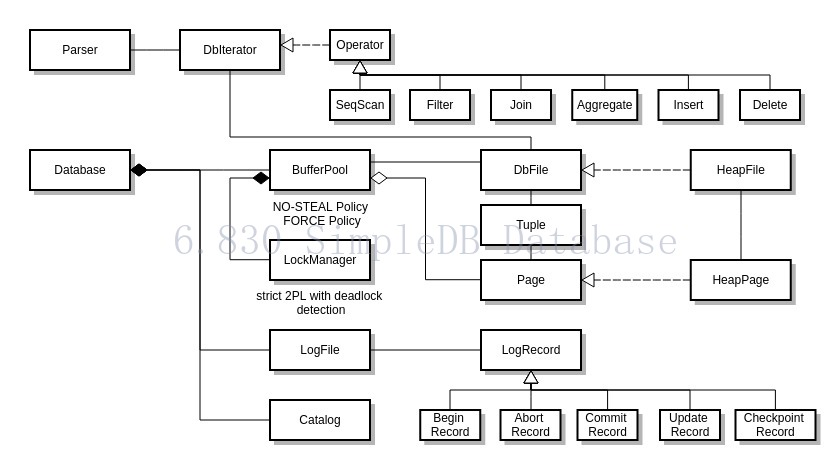

# Disclaimer
This repository contains my implementation of `SimpleDB` from MIT 6.830(Intro to Database Systems), which focus on the **Storage** part
rather than the **Server** part of a RDBMS. 

All source code lies in `src/java/simpleDB`

I made this repo public only intended for the examine of future employer and serve as a reference for other people who are struggling in this project. Otherwise,
it should be private in accordance with the course policy.

# Main part
- [x] Lab1, [Storage File Definition](https://github.com/Zwen092/6.830/tree/master/src/java/simpledb/storage)
- [x] Lab2, [Operators](https://github.com/Zwen092/6.830/tree/master/src/java/simpledb/execution)
- [x] Lab3, [Query Optimizing](https://github.com/Zwen092/6.830/tree/master/src/java/simpledb/optimizer)
- [x] Lab4, [Transaction Management](https://github.com/Zwen092/6.830/tree/master/src/java/simpledb/transaction)
- [ ] Lab5, [B+ Tree](https://github.com/Zwen092/6.830/tree/master/src/java/simpledb/index)
- [x] Lab6, [Logging Recovery](https://github.com/Zwen092/6.830/blob/master/src/java/simpledb/storage/LogFile.java)

# Architecture
